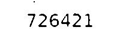
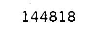
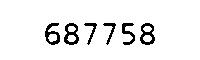
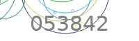
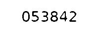
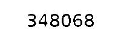

# CAPTCHA OCR

This Python script processes CAPTCHA images and extracts text using the Tesseract OCR engine.

## Description

This script processes CAPTCHA images to make them suitable for OCR and then extracts text from them. It uses the PIL (Python Imaging Library) to manipulate images and pytesseract for text recognition.

## Installation

1. Clone the repository:
    ```bash
    git clone https://github.com/RlNZLER/captcha_reader.git
    ```

2. Install dependencies using pip:
    ```bash
    pip install -r requirements.txt
    ```

3. Download and install Tesseract OCR. You can download it from [here](https://github.com/UB-Mannheim/tesseract/wiki).

4. Set the Tesseract executable path in the script:
    ```python
    pytesseract.pytesseract.tesseract_cmd = r"C:\Program Files\Tesseract-OCR\tesseract.exe"
    ```

## Usage

1. Place your CAPTCHA images in the `test` directory.

2. Run the script:
    ```bash
    python captcha_ocr.py
    ```

3. The processed images will be saved in the `result` directory, and the extracted text will be printed to the console.

## Results

| CAPTCHA Image | Processed Image | Extracted Text |
|---------------|-----------------|----------------|
|  |  | 724621 |
|  |  | 144818 |
|  |  | 687758 |
|  |  | 053842 |
|  |  | 348068 |

## Contributing

Contributions are welcome! If you'd like to contribute to this project, please fork the repository and submit a pull request.

## License

This project is licensed under the MIT License - see the [LICENSE](LICENSE) file for details.

